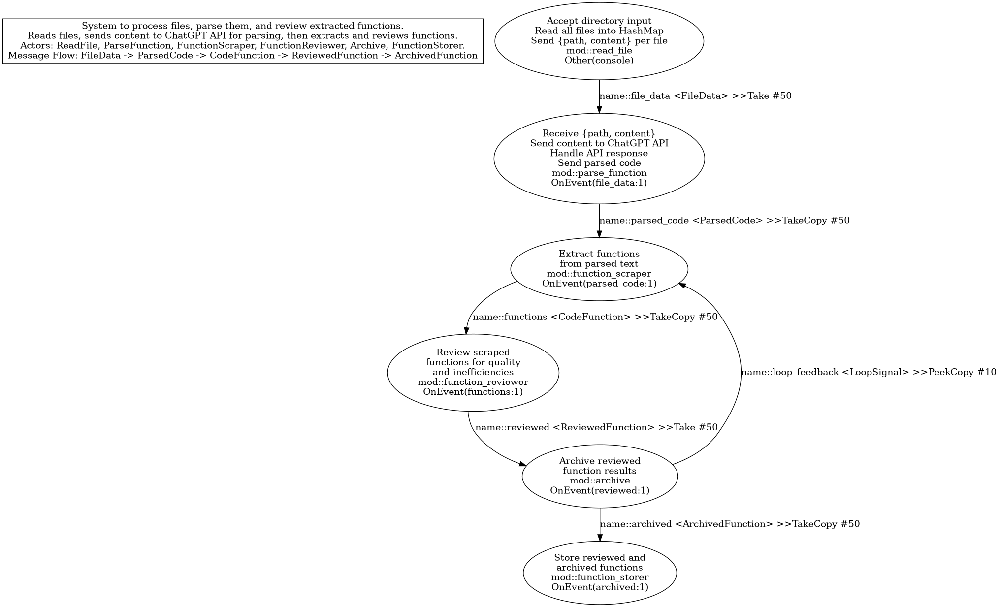

# 🤖 AI Codebase Review Assistant

**AI Codebase Review Assistant** is a powerful tool built in **Rust**, using the **Steady State async runtime**, designed to help developers improve their codebases. It analyzes source code, detects inefficiencies, and suggests intelligent optimizations — all powered by AI.

## 📚 Table of Contents

|                                   |                                  |
|------------------------------------------------|--------------------------------------------------|
| [✨ Features](#-features)                       | [🧪 Testing](#-testing)                          |
| [🚀 Installation Guide](#-installation-guide)   | [▶️ Usage](#-usage)                              |
|   â€¢ [1. Clone the Repository](#1-clone-the-repository) | [🧵 Asynchronous Architecture](#-asynchronous-architecture) |
|   â€¢ [2. Create a .env File](#2-create-a-env-file)     | [📠.gitignore Tips](#-gitignore-tips)          |
|   â€¢ [3. Build the Project](#3-build-the-project)     | [📜 License](#-license)                          |
|                                   |                                  |
|------------------------------------------------|--------------------------------------------------|


## ✨ Features

- ⚙️ **AI-Powered Analysis** – Uses OpenAI's API to analyze and understand your code
- ⚡ **Asynchronous Performance** – Built with Steady State for efficient async processing
- 🧠 **Smart Suggestions** – Detects inefficient patterns and recommends improvements
- 👨‍💻 **Beginner-Friendly Output** – Easy-to-understand recommendations

---

## 🚀 Installation Guide

### 1. Clone the Repository

```sh
git clone https://github.com/AiCodeReview.git
cd AiCodeReview
```

### 2. Create a `.env` File

Before running the project, create a file named `.env` in the root directory with the following content:

```env
OPENAI_API_KEY="your-api-key-here"
DIRECTORY="path-to-codebase-to-analyze"
REVIEW_OUTPUT="path-to-store-output"
```

- `OPENAI_API_KEY` – Your OpenAI API key
- `DIRECTORY` – The folder path of the codebase you want to analyze
- `REVIEW_OUTPUT` – Where the analysis output will be saved

> ⚠️ **Important**: Do not share your `.env` file or upload it to version control.

### 3. Build the Project

#### For Development (Faster Builds)
```sh
cargo build
```

#### For Production
```sh
cargo build --release
```

---

## 🧪 Testing

> ℹ️ Note: The `cargo test` functionality is **not fully implemented** yet. For now, focus on building and running the project.

---

## ▶️ Usage

To run the project in release mode:

```sh
cargo run --release
```

The assistant will start analyzing the directory specified in your `.env` file.

---

## 🧵 Asynchronous Architecture

This project is built on **Steady State**, an async runtime optimized for speed and performance. It helps handle multiple code analysis tasks in parallel without blocking, making the tool fast and efficient.

You can visualize the project’s async architecture here:



---

## 📁 .gitignore Tips

Make sure your `.env` file is **ignored** by Git to keep your API keys and settings secure.

Add this line to your `.gitignore` file if it’s not already there:

```
.env
```

If you've already committed it before, run this:

```sh
git rm --cached .env
git commit -m "Stop tracking .env file"
```

---

## 📜 License

This project is licensed under the **MIT License** — feel free to use, modify, and distribute it.
